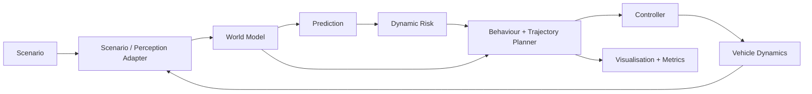

# PathWeaver

> Logo placeholder: `media/pathweaver-logo.png` (not yet created)

PathWeaver is a MATLAB-first, lane-agnostic, risk-aware navigation prototype for
Smart India Hackathon 2026 problem statement **SIH26037**, “Adaptive Path
Planning and Collision Avoidance for Autonomous Vehicles on Unstructured Indian
Roads.” Its core insight is: **do not plan only around where road users are;
plan around where they might be.**

## Current status

**Design-only fallback; not runnable.** MATLAB and RoadRunner were unavailable
during the 2026-09-03 environment preflight. In accordance with the project
policy, no substitute implementation was created and no unexecuted code,
telemetry, metric, visual, Simulink model, or RoadRunner asset is presented as
working. See [Environment](docs/ENVIRONMENT.md) and
[Implementation plan](docs/IMPLEMENTATION_PLAN.md).

PathWeaver v0.1 consumes simulated world-state data. Multi-sensor perception,
detection and sensor fusion are planned for later versions and are not claimed
by this prototype.

## Intended vertical slice

The planned `village_crossing` simulation contains an irregular unmarked road,
explicit free-space boundaries, ego vehicle, delayed pedestrian crossing,
oncoming two-wheeler, pothole, and goal. It will connect class-conditioned
constant-velocity prediction and expanding uncertainty to time-indexed dynamic
risk, sampled trajectories, deterministic behaviour, closed-loop control,
measured metrics, and technical visualisation.

It will not claim camera/LiDAR/radar processing, sensor fusion, trained machine
learning, Hybrid A*, MPC, road-ready dynamics, or native RoadRunner integration
unless those capabilities are later implemented and verified.

## Architecture



See [Architecture](docs/ARCHITECTURE.md) and
[Algorithms](docs/ALGORITHMS.md) for contracts, equations, units, and timing.

## Repository structure

```text
matlab/+pathweaver/   planned MATLAB packages
simulink/             builder and generated-model locations
roadrunner/           native asset status and port notes
tests/                planned matlab.unittest suites
config/               planned deterministic configurations
docs/                 architecture, algorithms, environment, and roadmap
media/                screenshot/logo locations; generated video ignored
artifacts/            ignored evaluation output
```

## Prerequisites

MATLAB is mandatory. Minimum toolbox requirements will be established by API
preflight; the design aims to keep core mathematics MATLAB-only. Simulink is
required for P1 integration. Automated Driving Toolbox is preferred for scenario
rendering but must be feature-detected. RoadRunner and Stateflow are optional P2
features and must never be assumed.

## Setup and commands

The target commands, to be implemented and verified after MATLAB installation,
are:

```matlab
setupPath
runPathWeaverDemo
runPathWeaverEvaluation
results = runtests('tests','IncludeSubfolders',true);
assertSuccess(results)
```

No exact executable command is presently available because entry points do not
yet exist. Installation begins by running the preflight in
`docs/ENVIRONMENT.md`, then following `docs/IMPLEMENTATION_PLAN.md`.

## Evidence placeholders

- Screenshot: unavailable; no simulation has run.
- Video: unavailable; no simulation has run.
- Evaluation: unavailable; no measurements have been made.
- Tests: unavailable; no MATLAB runtime exists on this host.

## Roadmap and safety

The phased roadmap is in [Roadmap](docs/ROADMAP.md). This is intended as a
simulation prototype, not a road-ready autonomy system. It has no road-deployment
validation and must not control a real vehicle.

## Licence

No distribution licence has been selected. See [licence decision](LICENSE.md).
