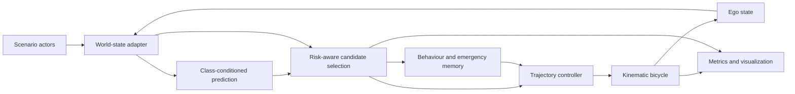

<p align="center">
  
</p>

# PathWeaver

**Plan around where road users might be, not only where they are.**

A MATLAB-first, lane-agnostic navigation simulation for **SIH26037**:
*Adaptive Path Planning and Collision Avoidance for Autonomous Vehicles on
Unstructured Indian Roads.*

**Team PathWeaver · Bennett University · BU SIH-26 Phase 2**

## Run the prototype

Open this repository as MATLAB's Current Folder:

```matlab
setupPath
runPathWeaverDemo(preset="nominal", seed=26037, playbackSpeed=4);
```

Space pauses, R resets reproducibly, and Esc stops. The figure exposes candidate
paths, prediction uncertainty, decision reasons, costs and measured telemetry.
Choose `preset="challenging"` or `preset="emergency"` for the other encounters;
use `plannerMode="baseline"` for the fixed-uncertainty comparison.

For the live presentation, follow the [three-minute demonstration guide](docs/DEMO.md).

## What works

- Three reproducible variants of one unmarked village road: irregular boundaries,
  crossing pedestrian, oncoming two-wheeler, pothole and goal.
- Simulated world-state adapter, class-conditioned constant-velocity prediction
  and expanding covariance.
- Time-aligned risk scoring, multiple trajectory candidates, inspectable costs,
  swept footprint constraints and bounded emergency response.
- Stateful behaviour, trajectory tracking and simplified kinematic-bicycle
  motion in a genuine MATLAB closed loop.
- Live diagnostics, MP4 recording, deterministic resets and paired evaluation
  with per-run parameters, source provenance and measured metrics.

PathWeaver v0.1 consumes simulated world-state data. Multi-sensor perception,
detection and sensor fusion are planned for later versions and are not claimed
by this prototype.

## Integration status

| Component | Actual execution |
| --- | --- |
| MATLAB | Complete simulation, prediction, planning, behaviour, control and metrics |
| Simulink vehicle model | Recorded MATLAB signals through explicitly labelled replay blocks |
| Separate Stateflow harness | Shared stateful behaviour kernel executes at simulation time; tested reset and ordered sequences |
| RoadRunner and perception | Not integrated; no native scene, sensor processing or fusion claim |

The Stateflow harness does not control the live demo. This is not a road-ready
autonomy system, and it must not control a real vehicle.

## Architecture



The baseline already predicts mean motion. PathWeaver adds class-conditioned
uncertainty growth; both modes retain identical physical encounters, candidate
families, collision constraints and control.

## Verification and recording

The Phase 2 release passed **39 tests** and completed **60 paired simulation
runs** across three presets without observed collisions. Both modes completed
all runs; this sample does not demonstrate collision reduction or road safety.
The [release report](docs/RELEASE.md) records the exact revision, measured
trade-offs and limitations. A verified 24.3-second backup video can be regenerated
with the command below.

```matlab
% Full unit/integration suite:
runPathWeaverTests;

% Paired benchmark: 10 seeds × 3 presets × 2 modes:
runPathWeaverEvaluation(outputDirectory="artifacts/release/evaluation");

% Headless simulation:
runPathWeaverDemo(preset="nominal", visualization=false);

% Real backup video and provenance:
recordPathWeaverEvidence(preset="nominal");

% Optional reproducible integration models:
buildPathWeaverModel;
buildPathWeaverStateflowModel;
```

With MATLAB on PATH, the non-interactive test command is:

```sh
matlab -batch "runPathWeaverTests;"
```

Tests cover geometry, contact timing, prediction, costs, fallback, control,
repeatability, paired conditions, graphics pacing and available integrations.
See [release verification](docs/RELEASE.md) for executed results and provenance,
and [metric definitions](docs/METRICS.md) before interpreting TTC or risk.

Generated models, benchmark output, recordings and temporary files stay under
ignored output locations. A fresh clone must regenerate its evidence.

## Requirements

Verified on **MATLAB R2026a Update 5**, Apple-silicon macOS. The numerical core
and technical display use MATLAB. The optional builders require Simulink and
Stateflow respectively; unavailable integration products are not prerequisites
for the MATLAB demo. Other releases/platforms have not been verified here.

See the [environment inventory](docs/ENVIRONMENT.md). No additional web frontend,
Python simulator or trained model is required.

## Repository guide

```text
config/                scenario presets and algorithm parameters
matlab/+pathweaver/     testable core packages
tests/                 matlab.unittest regressions
simulink/models/       generated models (ignored)
roadrunner/projects/   reserved for future native assets; none claimed
docs/                  methods, interfaces, validation and demonstration guide
media/                 project identity
artifacts/             generated evidence (ignored)
```

- [Architecture and data contracts](docs/ARCHITECTURE.md)
- [Algorithms and configurable costs](docs/ALGORITHMS.md)
- [Geometry, TTC and evaluation protocol](docs/METRICS.md)
- [Live walkthrough and judge questions](docs/DEMO.md)
- [Limitations and next phases](docs/LIMITATIONS.md)
- [RoadRunner reconstruction plan](docs/ROADRUNNER_PORT.md)

## Next steps

1. Broader robustness tests and delayed/noisy track inputs.
2. Native RoadRunner bridge and incremental Simulink vehicle execution.
3. Sensor processing, calibrated tracking uncertainty and more scenario families.

Released under the MIT Licence. See [LICENSE.md](LICENSE.md).
