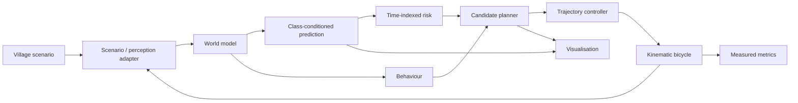

# PathWeaver

> Logo location: `media/pathweaver-logo.png` (placeholder)

PathWeaver is a MATLAB-first, lane-agnostic, risk-aware navigation prototype for
Smart India Hackathon 2026 problem statement **SIH26037**, “Adaptive Path
Planning and Collision Avoidance for Autonomous Vehicles on Unstructured Indian
Roads.”

**Core insight:** Do not plan only around where road users are. Plan around where
they might be.

## What v0.1 implements

- Deterministic `village_crossing` with an irregular unmarked road, explicit
  boundaries, pedestrian, oncoming two-wheeler, pothole, and goal.
- Explicit simulated-world-state adapter and documented data contracts.
- Class-conditioned constant-velocity prediction for pedestrians,
  two-wheelers, cars, and animals with expanding PSD covariance.
- Time-aligned Mahalanobis risk scores and hard footprint constraints.
- Smooth lateral/longitudinal sampling with 20+ genuine candidates.
- Nine separately inspectable planner cost terms and deterministic selection.
- Seven-state behaviour logic with transition logs and emergency hysteresis.
- Pure-pursuit-style steering, bounded PI speed control, emergency override, and
  kinematic-bicycle motion in a closed loop.
- Dark live technical visualisation and optional MP4 recording.
- Paired baseline/risk-aware evaluation with MAT, CSV, and figure export.
- Reproducibly generated and runnable Simulink replay integration model.
- Fifteen automated MATLAB unit/integration tests.

PathWeaver v0.1 consumes simulated world-state data. Multi-sensor perception,
detection and sensor fusion are planned for later versions and are not claimed
by this prototype.

It does not implement camera/LiDAR/radar processing, trained machine learning,
Hybrid A*, model-predictive control, production vehicle dynamics, or native
RoadRunner integration.

## Architecture



See [Architecture](docs/ARCHITECTURE.md) and
[Algorithms](docs/ALGORITHMS.md) for contracts, equations, units, and timing.

## Repository structure

```text
config/                deterministic configurations
matlab/+pathweaver/    core MATLAB packages
simulink/              replay-model builder/output location
tests/                 matlab.unittest suites
docs/                  design, environment, limitations, and roadmap
media/                 media notes; generated video is ignored
artifacts/             ignored demo and evaluation outputs
```

## Prerequisites

Verified with MATLAB R2026a Update 5 on Apple silicon macOS. The numerical core
uses MATLAB only. Simulink is required for its optional integration model. See
[Environment](docs/ENVIRONMENT.md) for the installed inventory.

## Exact commands

From MATLAB with this repository as the current folder:

```matlab
setupPath
result = runPathWeaverDemo;
results = runPathWeaverEvaluation;
testResults = runPathWeaverTests;
modelPath = buildPathWeaverModel;
```

Headless default demo:

```sh
/Users/shivamkumar/Applications/MathWorks/R2026a.app/bin/matlab -batch "runPathWeaverDemo(visualization=false);"
```

Optional recording:

```matlab
runPathWeaverDemo(video=true)
```

Generated MAT, CSV, figures, models, and videos are ignored by Git.

## Current measured status

The default risk-aware seed completes without collision in 26.65 simulated
seconds. Across ten paired seeds, both modes completed 10/10 runs with zero
collisions. Mean minimum TTC was 0.098 s for baseline and 0.104 s for risk-aware
mode; this small difference is reported without claiming decisive superiority.
Runtime values depend on host load and should be remeasured locally.

All 15 automated tests pass, including default completion and Simulink
build/update/run. See [Limitations](docs/LIMITATIONS.md) before interpreting these
simulation-only results.

## Media, roadmap, and safety

Media locations are described in [media/README.md](media/README.md). See the
[Roadmap](docs/ROADMAP.md) for future work. This is a simulation prototype, not a
road-ready autonomy system, and must not control a real vehicle.

## Licence

No distribution licence has been selected. See [licence decision](LICENSE.md).
