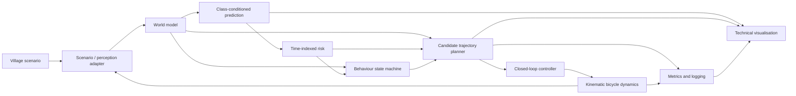

# Architecture

## Honest scope

PathWeaver v0.1 consumes simulated world-state data. Multi-sensor perception,
detection and sensor fusion are planned for later versions and are not claimed
by this prototype.

This architecture is implemented by the MATLAB closed loop. The Simulink model
is a generated replay integration boundary. A generated Stateflow chart verifies
direct behaviour decisions, while the closed loop retains MATLAB dwell memory.

## Data flow

The adapter is the sole producer of the world-state contract. A future fused
track source can replace scenario truth without changing prediction or planning.

## Package ownership

| Package | Responsibility | Must not own |
|---|---|---|
| `scenario` | road geometry, deterministic actors, adapter | planning policy |
| `core` | contracts, validation, geometry utilities | scenario behaviour |
| `prediction` | future agent distributions | ego control |
| `planning` | risk, candidates, constraints, costs | plotting |
| `behavior` | discrete state and hysteresis | dynamics integration |
| `control` | tracking commands and bicycle update | scenario scripts |
| `simulation` | loop ordering, replay, log assembly | planner mathematics |
| `visualization` | read-only rendering and video | telemetry synthesis |
| `evaluation` | metrics, seed sweeps, exports | production state |

## Coordinate frames and units

The world frame is right-handed in the road plane. `xWorld` is longitudinal in
the nominal forward direction; `yWorld` is lateral left; heading is radians from
positive x toward positive y. Ego-frame x is forward and ego-frame y is left.
Transforms must be named explicitly.

Internal units are metres, seconds, metres/second, metres/second squared,
radians, radians/metre curvature, and metres squared covariance. Kilometres/hour
is presentation-only. Covariances are expressed in the world frame unless a
field name states otherwise.

## Contracts

Contracts should be scalar MATLAB structures validated by pure functions.

### EgoState

`positionWorldM` (1x2), `headingRad`, `speedMps`, `accelerationMps2`,
`steeringRad`, `timestampS`.

### AgentState

`id`, `class` (`pedestrian`, `two_wheeler`, `car`, `animal`),
`positionWorldM` (1x2), `velocityWorldMps` (1x2), `headingRad`, dimensions or
`collisionRadiusM`, `positionCovarianceWorldM2` (2x2), `timestampS`.

### StaticObstacle

`id`, `geometryType`, `positionWorldM`, `geometry`, `obstacleType`. Geometry is
either circle radius or a consistently wound polygon.

### PredictedState

`agentId`, `futureTimestampS`, `expectedPositionWorldM`,
`positionCovarianceWorldM2`, footprint, and occupancy parameters. A prediction
is an ordered array sharing the candidate time grid.

### CandidateTrajectory

Ordered `timestampsS`, `positionsWorldM`, `headingsRad`, `speedsMps`,
`accelerationsMps2`, `curvaturesPerM`; named `costTerms`; `totalCost`,
`isFeasible`, and `rejectionReason`.

### PlannerOutput

`selectedTrajectory`, all `candidateTrajectories`, measured `planningLatencyS`,
`riskScore`, `minimumTtcS`, `behaviorState`, and `emergencyFlag`.

## Timing semantics

Target integration step is 0.05 s, replan interval 0.15 s, prediction/candidate
step 0.20 s, and horizon 3.0 s. Actor truth advances to time `t` before the
adapter snapshots it. Prediction and planning use that same timestamp. The
controller command applies over `[t,t+dt)`. Planner wall time is measured with
`tic/toc` and never substituted for simulation time.

Replay records configuration, seed, initial state, actor state at each tick,
planner outputs, controls, and next ego state. Determinism is checked within
documented floating-point tolerances, not byte identity of figures.

## Extension points

- Replace the scenario adapter with timestamped fused tracks.
- Replace constant velocity with a learned predictor while retaining predicted
  distribution contracts.
- Add a RoadRunner adapter after native APIs are detected.
- Wrap shared MATLAB System blocks or functions in a generated Simulink model.
- Migrate behaviour to Stateflow only after transition equivalence tests exist.
