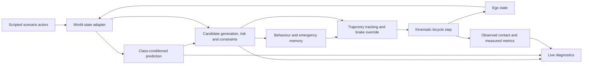

# Architecture

PathWeaver is a MATLAB-first closed loop, not a sensor-processing system.
PathWeaver v0.1 consumes simulated world-state data. Multi-sensor perception,
detection and sensor fusion are planned for later versions and are not claimed
by this prototype.

## Execution flow

At time t, actor and ego snapshots are aligned. Prediction and candidate
selection run every 0.15 s; behaviour and control run every 0.05 s. The controller
advances the ego while exogenous actors advance over the same interval.
Swept contact is checked before logging/rendering the next state. Prediction
knots are 0.2 s apart over a 3 s horizon. The view identifies the last plan's age.
Display pacing does not advance simulation time.

## Ownership

| Package | Owns |
| --- | --- |
| `scenario` | Road, clock-driven actors, isolated seeded randomness, adapter |
| `core` | Validation, covering footprints, swept geometry |
| `prediction` | Mean motion and world-frame covariance |
| `planning` | Candidates, time-indexed risk, constraints, cost decomposition |
| `behavior` | Shared numeric decision kernel, state memory and transition reasons |
| `control` | Trajectory tracking, actuator bounds and bicycle integration |
| `simulation` | Fixed-step orchestration, logs, replay input |
| `visualization` | Rendering and recording actual state; display-only controls |
| `evaluation` | Metric definitions, paired runs, exports and provenance |

There is no global RNG reset, base-workspace dependency in the core, plotting
inside the planner, or preset-name branch inside the controller.

## Coordinates and contracts

x is world-forward metres; y is lateral-left metres. Heading is counterclockwise
from +x, in radians. Speed is m/s, acceleration m/s², curvature 1/m, steering
radians, timestamps seconds and covariance m². km/h appears only in presentation.
The virtual bicycle reference point is also the body centre; see
[geometry conventions](METRICS.md) for this deliberate simplification.

Contracts are plain structures:

| Contract | Implemented fields |
| --- | --- |
| EgoState | `positionWorldM` (1×2), `headingRad`, `speedMps`, `accelerationMps2`, `steeringRad`, `timestampS` |
| AgentState | `id`, `class`, `positionWorldM`, `velocityWorldMps`, `headingRad`, `collisionRadiusM`, `positionCovarianceWorldM2` (2×2), `timestampS` |
| StaticObstacle | `id`, `geometryType`, `positionWorldM`, `geometry.radiusM`, `obstacleType`; circle geometry only |
| PredictedState | One structure per agent: `agentId`, `class`, `futureTimestampsS` (N×1), `expectedPositionsWorldM` (N×2), `positionCovariancesWorldM2` (2×2×N), `collisionRadiusM` |
| CandidateTrajectory | `timestampsS`, `positionsWorldM`, `headingsRad`, `speedsMps`, `accelerationsMps2`, `curvaturesPerM`, `costTerms`, `weightedCostTerms`, `totalCost`, `isFeasible`, `isEmergencyBraking`, `rejectionReason` |
| PlannerOutput | Selected/all candidates, `planningLatencyS`, `riskScore`, `minimumTtcS`, `behaviorState`, `emergencyFlag`; loop adds `timestampS` |

World-state includes ego, agents, static obstacles, timestamp and source label.
Prediction rejects stale actor timestamps; risk scoring rejects mismatched time
grids instead of silently pairing different times.

Results retain configuration, initial/final scenario, ego log, per-planning-call
latency log, transitions, metrics and final diagnostic frame. Demo results add
source provenance. They do not store every candidate or actor at every tick:
the deterministic scenario/configuration can regenerate these. Latency and
render timing are inherently nondeterministic and excluded from replay equality.

## What executes in MathWorks tools

| Entry point | Execution |
| --- | --- |
| `runPathWeaverDemo` | MATLAB prediction, planning, behaviour, control and vehicle motion in closed loop |
| `buildPathWeaverModel` | Generates `pathweaver_v0.slx`; recorded MATLAB signals pass through explicitly labelled replay blocks |
| `buildPathWeaverStateflowModel` | Generates `pathweaver_behavior.slx`; the shared stateful behaviour kernel executes inside Stateflow at 0.05 s |

The Stateflow harness has one execution state and seven numeric behaviour codes.
It is not a graphical seven-state transition network. Its chart compiles and
calls the same pure `stepDecision` function as the MATLAB adapter, retaining
state and dwell memory between samples. Defined ordered sequences test outputs,
reasons, memory, initialization and recovery. This does **not** establish full
closed-loop MATLAB/Simulink equivalence. The live demo remains MATLAB-controlled.

Both builders use model workspaces, not caller base-workspace variables.
Replay exposes ego x/y/speed, selected endpoint x/y, behaviour code, risk and
availability flags. Initial unavailable values remain NaN, not fabricated zeros.

## Next integration boundary

Replace the ground-truth adapter with timestamped sensor tracks carrying IDs,
class, state, footprint and covariance. That requires additional handling for
latency, missed detections, track lifecycle and calibration; it is not a drop-in
claim that sensors already work. Native RoadRunner needs a supported licensed
host, coordinate/time validation and an ego-control bridge. See
[RoadRunner port](ROADRUNNER_PORT.md) and [limitations](LIMITATIONS.md).
